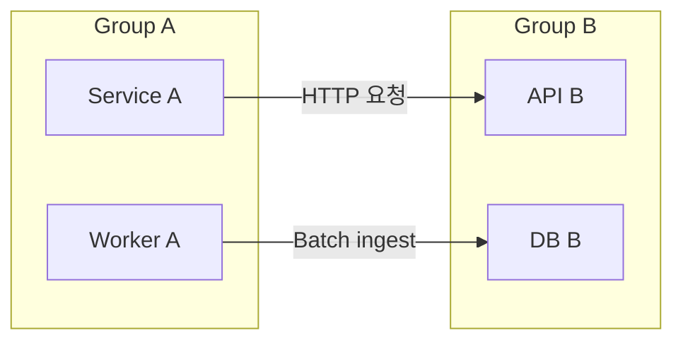
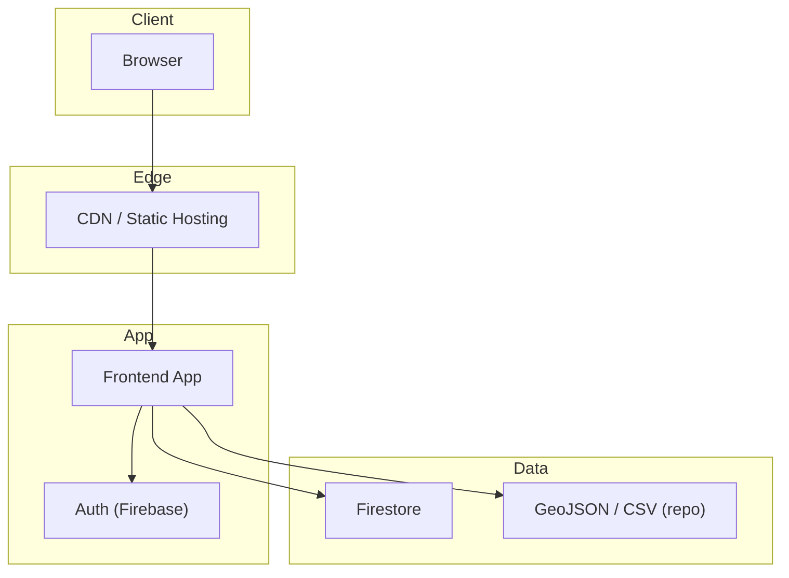
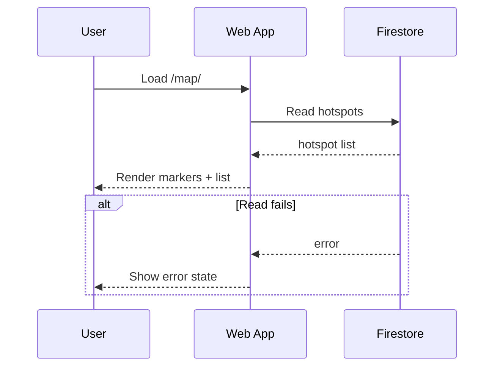
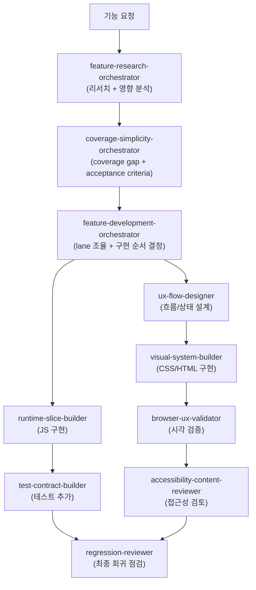

# Project: 대한민국 성남시 판교/운중/백현/대장 시의원 웹페이지

## Project Overview

정적 웹 앱(Static Web App)이며 GitHub Pages로 배포합니다. 지도는 OpenLayers(OL) + OSM 타일을 사용하고, 인증/데이터는 Firebase Auth + Firestore를 사용합니다. 설정은 `config.js`에서 관리합니다.

## Key Paths

```text
.
├─ .github/workflows/     # GitHub Actions: Pages 배포
├─ assets/                # 이미지, 아이콘 등 정적 리소스
├─ data/                  # GeoJSON/WFS XML/CSV 데이터
├─ map/                   # 지도 열람 화면
│  └─ edit/               # 지도 편집 화면(로그인 필요)
├─ scripts/               # 운영 스크립트
├─ system/                # 시스템 런처/로그인 관련 화면
├─ app.js                 # 지도/데이터/오버레이 핵심 로직
├─ config.js              # 실행 설정(노출됨)
├─ config.example.js      # 설정 예시
├─ index.html             # 공개 랜딩
└─ styles.css             # 공통 스타일
```

## Documentation & Diagrams (GitHub Markdown)

이 저장소의 아키텍처 다이어그램은 GitHub Markdown에서 **Mermaid**와 **GeoJSON**을 적극적으로 사용합니다.

이 문서는 "에이전트가 바로 실행 가능한" 지시서로 유지합니다.

- 저장소에 특화된 규칙/결정을 우선 기록합니다(불필요한 일반론 최소화).
- 체크리스트/템플릿 중심으로 작성해, 결정을 다시 묻지 않게 합니다.

### Primary Formats (Decided)

- Mermaid: 코드펜스 ` ```mermaid `
- GeoJSON: 코드펜스 ` ```geojson `

### Sub Diagram Split Convention (Decided)

전체를 한 장의 다이어그램으로 모으지 말고, 다음 3가지 축으로 분할합니다.

1) Ownership View: Entity/Component Ownership 경계(누가 책임지는가)
2) Layering View: 계층 구조(어디에 속하는가 / 의존 방향이 올바른가)
3) Relationship View: 유스케이스별 런타임 흐름(어떻게 상호작용하는가)

### Canonical Location (Docs Map)

아키텍처 문서는 아래 위치를 정식으로 사용합니다(없으면 생성).

- `docs/README.md`: 인덱스 + 범례 + 용어집(Owner, 약어, 색상/표기 규칙)
- `docs/ownerships.md`: Ownership 다이어그램(서비스/컴포넌트 경계)
- `docs/layers.md`: Layering 다이어그램(계층 고정 + 위로 향하는 의존 금지)
- `docs/relationships-*.md`: 유스케이스/런타임 다이어그램(파일 1개 = 유스케이스 1개)
- `docs/data-contracts.md`: 데이터 계약(IDs, 스키마, 보관/삭제, 소유권) + 링크

주의:

- 문서는 기본적으로 `docs/` 아래에 둡니다(`README.md`, `TODO.md`, `AGENTS.md` 제외).
- 다이어그램은 "읽는 사람(온보딩)" 기준으로 링크를 함께 제공합니다(노드 클릭 기능에 의존하지 않음).

### Copy/Paste Templates

#### Ownership View (Mermaid)



#### Layering View (Mermaid)



규칙:

- 의존/호출은 기본적으로 "위 계층 -> 아래 계층" 방향으로만 그립니다(역방향 화살표 금지).
- 교차 의존이 필요하면 Relationship View(유스케이스)에서만 예외적으로 표현합니다.

#### Relationship View (Mermaid sequenceDiagram)



#### GeoJSON (Minimal Example)

```geojson
{
  "type": "FeatureCollection",
  "features": [
    {
      "type": "Feature",
      "properties": { "name": "sample" },
      "geometry": { "type": "Point", "coordinates": [127.111, 37.394] }
    }
  ]
}
```

규칙:

- 큰 경계/격자 데이터는 Markdown에 인라인으로 넣지 말고 `data/*.geojson` 파일로 두고 링크합니다.

## Testing (Playwright)

이 저장소는 Playwright 기반 E2E/스모크 테스트를 사용합니다.

- 실행: `npm test`
- 설정: `playwright.config.js` (기본 webServer로 `npm run serve`, 기본 URL `http://localhost:5173`)
- 주요 아티팩트 루트(권장 탐색 경로):
  - `test-results/`
  - `playwright-report/`

### Final Report: Screenshot Path Listing (Decided)

테스트 실행 결과로 스크린샷이 생성된 경우, 최종 보고에 **모든 스크린샷 파일 경로**를 포함합니다(비교/검토를 쉽게 하기 위함).

수집 규칙(결정 완료):

- 검색 루트: `test-results/`, `playwright-report/`
- 확장자: `.png`, `.jpg`, `.jpeg`, `.webp`
- 정렬: 경로 기준 안정적 사전순 정렬
- 그룹핑: "즉시 부모 폴더(보통 Playwright의 테스트별 output dir)" 단위로 묶고,
  폴더명에서 spec/test 이름을 유추할 수 있으면 함께 표기(불가하면 폴더명만 표기)
- 부가 출력: `playwright-report/index.html`이 존재하면 해당 경로도 함께 출력

## Security Notes

- `config.js`는 정적 호스팅 특성상 사용자 브라우저에 노출됩니다. 토큰/비밀키를 직접 넣지 않습니다.
- 외부 API 토큰이 필요하면 프록시/서버측 비밀 저장소(예: Secret Manager)로 이동하는 방식을 우선 고려합니다.

## Technical Notes

- Static Hosting: GitHub Pages에서 정적 파일 서빙.
- Map Engine: OpenLayers(OL) CDN 로드 + OSM 타일.
- Auth: Firebase Auth(Google Sign-In), staff 커스텀 클레임으로 편집 권한 제어.
- Data Store: Firestore 컬렉션 `crowd_hotspots` 사용.
- External Data:
  - 동 경계: WFS XML/GeoJSON (`data/*.wfs.xml`, `data/dong-boundaries.sample.geojson`).
  - 유동 인구: CSV/JSON 또는 OpenAPI (`data/*.csv`, `mobilityPopulation` 설정).
  - 교통/보행 오버레이: 외부 API (`trafficOverlays` 설정).
  - 외부 현안 카탈로그: `data.issueCatalog` 설정.
- Security: App Check 옵션 존재(기본 비활성), API 토큰은 프론트에 직접 노출 금지 권장.

## Entry Pages

Update this section if new entry points are added or removed. This helps testing and onboarding.

- `/` : 공개 랜딩 (`index.html`)
- `/map/` : 현안 열람
- `/map/edit/` : 현안 편집(로그인 필요)
- `/system/` : 내부 시스템 런처

## Implementation Policies

- No fake implementation, no stubs, no mocks.

### Test Files

- 테스트 파일은 최소한으로 유지하고, 불필요한 헬퍼 추가를 지양합니다. 테스트 커버리지를 높이는 것보다, 핵심 기능이 망가지지 않는다는 것을 확인하는 것이 중요합니다.
- 테스트 제목은 짧고 이해하기 쉽게 작성합니다.
- 테스트 코드 주석은 한국어로 작성합니다.

## Copilot Agent Orchestration

이 저장소는 VS Code GitHub Copilot 및 Copilot CLI에서 재사용 가능한 custom agent 체계를 `.github/agents/` 아래에 정의합니다.

### 디렉터리 구조

```text
.github/
└─ agents/
   ├─ coverage-simplicity-orchestrator.agent.md   # 테스트 커버리지 + 기술 복잡도 억제 조정자
   ├─ feature-research-orchestrator.agent.md       # Read-only 기능 연구 조정자
   ├─ feature-development-orchestrator.agent.md    # 구현 실행 조정자
   ├─ runtime-slice-builder.agent.md               # JS 런타임 단일 writer
   ├─ ux-flow-designer.agent.md                    # UX 흐름/상태 설계
   ├─ visual-system-builder.agent.md               # CSS/HTML 시각 구현
   ├─ browser-ux-validator.agent.md                # 브라우저 UI 검증
   ├─ accessibility-content-reviewer.agent.md      # 접근성/마이크로카피 검토
   ├─ test-contract-builder.agent.md               # Playwright 테스트 추가/보강
   └─ regression-reviewer.agent.md                 # 회귀 최종 점검
```

### Agent 역할 분담

| Agent | 역할 | 쓰기 권한 | 유형 |
|-------|------|-----------|------|
| `coverage-simplicity-orchestrator` | Coverage gap 파악 → acceptance criteria → 구현 handoff | 없음 (read-only) | Orchestrator |
| `feature-research-orchestrator` | 코드베이스 탐색 + 외부 문서 조회 → 리서치 요약 | 없음 (read-only) | Orchestrator |
| `feature-development-orchestrator` | 구현 lane 조율 → worker handoff 순서 결정 | 없음 (read-only) | Orchestrator |
| `runtime-slice-builder` | `app.js`, `launcher.js`, `service-shell.js` 구현 | JS 런타임 파일 전용 | Worker |
| `ux-flow-designer` | 화면 상태/흐름 Mermaid 다이어그램 설계 | 없음 (read-only) | Worker |
| `visual-system-builder` | CSS 파일 + HTML 마크업 구조 수정 | CSS + HTML | Worker |
| `browser-ux-validator` | 로컬 서버에서 UI 시각 검증 | 없음 (read-only) | Worker |
| `accessibility-content-reviewer` | aria/시맨틱/마이크로카피 검토 보고 | 없음 (read-only) | Worker |
| `test-contract-builder` | `tests/` 디렉터리 테스트 추가/수정 | tests/ 전용 | Worker |
| `regression-reviewer` | `npm test` + drift 최종 점검 | 없음 (read-only) | Worker |

### Handoff 흐름 (기능 개발 사이클)



### 핵심 원칙

#### 1. `app.js` 단일 Writer 원칙
`app.js`, `launcher.js`, `service-shell.js` 는 **`runtime-slice-builder` 만** 수정한다.
이 세 파일에 다른 agent가 동시에 접근하면 충돌이 발생한다.

#### 2. UI/UX Lane 분리 원칙
UI/UX 작업은 4개 역할로 분리되어 있다:
- **설계**: `ux-flow-designer` — Mermaid 다이어그램, 상태 목록 (코드 없음)
- **시각 구현**: `visual-system-builder` — CSS + HTML
- **검증**: `browser-ux-validator` — 브라우저에서 확인
- **접근성**: `accessibility-content-reviewer` — aria + 마이크로카피

#### 3. 테스트 우선 원칙
`coverage-simplicity-orchestrator`를 통해 진행할 때는 acceptance criteria가 확정되기 전에 구현 handoff를 하지 않는다.

#### 4. Read-Only Orchestrator 원칙
모든 Orchestrator(`coverage-simplicity`, `feature-research`, `feature-development`)는 코드를 직접 수정하지 않는다. 분석·결정·handoff만 수행한다.

### VS Code에서 사용하기

VS Code Chat에서 `@` 을 입력하면 `.github/agents/` 아래 정의된 custom agent 목록이 표시된다.

```
@coverage-simplicity-orchestrator 이 기능에 대한 coverage gap을 분석해줘
@feature-research-orchestrator app.js에서 이 패턴과 유사한 구현이 있는지 조사해줘
@runtime-slice-builder 이 acceptance criteria를 기반으로 구현해줘
```

### Copilot CLI에서 사용하기

Copilot CLI가 설치된 환경에서 custom agent를 사용하려면 VS Code 설정에서 아래를 활성화한다:

```json
"github.copilot.chat.cli.customAgents.enabled": true
```

활성화 후 CLI 세션에서 workspace-defined agent를 선택할 수 있다.

### 커스터마이징 확장 가이드

| 자산 유형 | 위치 | 목적 |
|-----------|------|------|
| **Agent** | `.github/agents/*.agent.md` | 역할별 persona + handoff |
| **Skill** | `.github/skills/*/SKILL.md` | VS Code/CLI/Cloud 공통 재사용 capability |
| **Instructions** | `.github/copilot-instructions.md` | 모든 세션에 항상 적용되는 컨텍스트 |
| **Prompt** | `.github/prompts/*.prompt.md` | 반복적인 one-shot 워크플로 |
